# 📚 Sistem Informasi Perpustakaan

## Deskripsi

Sistem Informasi Perpustakaan merupakan aplikasi berbasis Laravel yang digunakan untuk mengelola data buku, anggota, serta transaksi peminjaman dan pengembalian buku. Aplikasi ini juga dilengkapi dengan fitur laporan transaksi, perhitungan denda keterlambatan, serta notifikasi buku yang terlambat dikembalikan.

---

## 👤 Identitas

**Nama :** Zahra Zahrani
**NIM :** 60324011
**Mata Kuliah :** Pemrograman Web 2

---

# ✨ Fitur Aplikasi

## 📖 Manajemen Buku

* Menampilkan daftar buku
* Menambah data buku
* Mengubah data buku
* Menghapus data buku
* Mengelola stok buku

## 👥 Manajemen Anggota

* Menampilkan daftar anggota
* Menambah anggota
* Mengubah anggota
* Menghapus anggota

## 🔄 Transaksi Peminjaman

* Menambah transaksi peminjaman
* Menampilkan detail transaksi
* Pengembalian buku
* Update stok otomatis saat buku dikembalikan
* Perhitungan denda sebesar **Rp5.000/hari** apabila terlambat mengembalikan buku

## 📄 Laporan Transaksi

* Filter berdasarkan tanggal
* Filter berdasarkan status transaksi
* Filter berdasarkan anggota
* Menampilkan total transaksi
* Menampilkan total denda
* Export laporan ke PDF

## 🔔 Notifikasi Keterlambatan

* Widget jumlah buku terlambat pada dashboard
* Daftar anggota yang terlambat
* Badge **"Terlambat"** pada daftar transaksi
* Reminder pada halaman detail transaksi apabila melewati tanggal pengembalian

---

# 🖼️ Screenshot Aplikasi

## 1. Dashboard

Halaman utama aplikasi yang menampilkan ringkasan informasi.

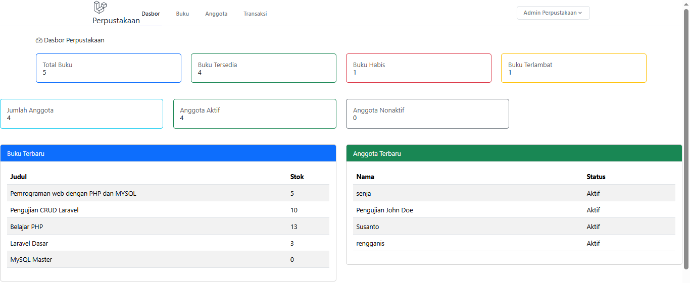

---

## 2. Data Buku

Menampilkan seluruh data buku yang tersedia di perpustakaan.

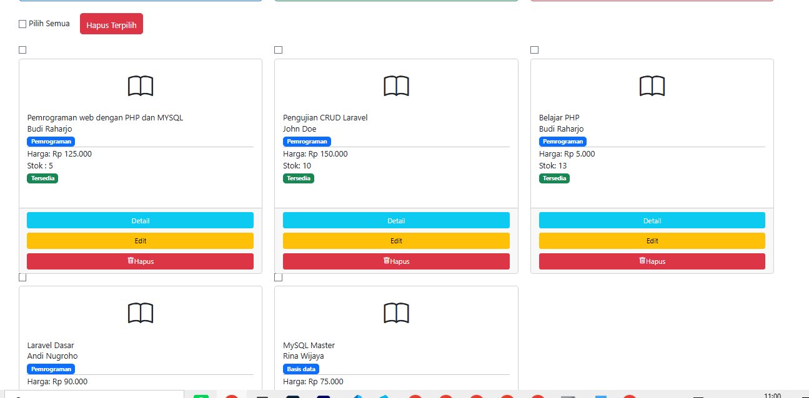

---

## 3. Data Anggota

Menampilkan daftar anggota perpustakaan.

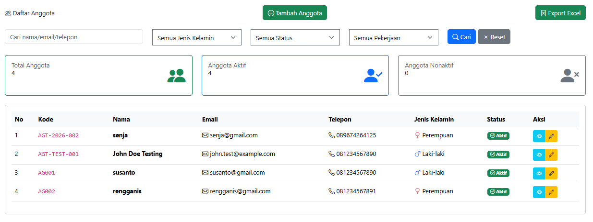

---

## 4. Daftar Transaksi

Halaman yang menampilkan seluruh transaksi peminjaman buku.

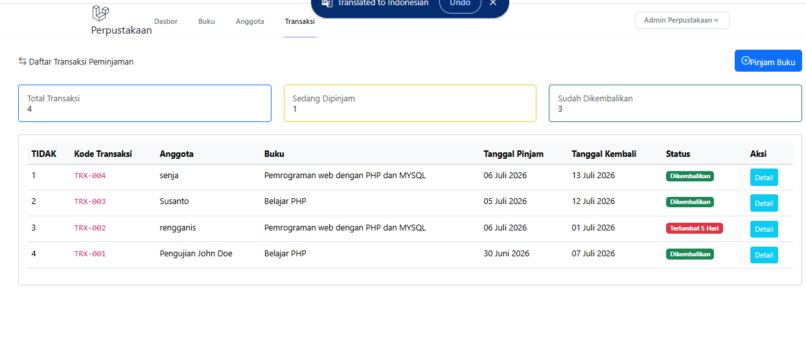

---

## 5. Detail Transaksi

Menampilkan informasi lengkap mengenai transaksi peminjaman.

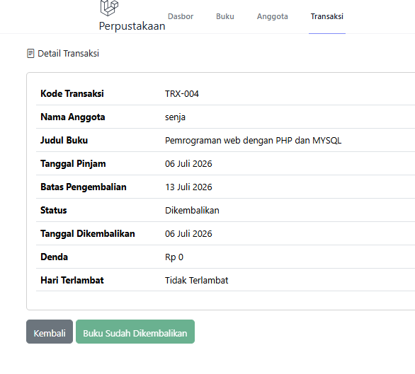

---

## 6. Pengembalian Buku

Proses pengembalian buku melalui tombol **Kembalikan Buku**.

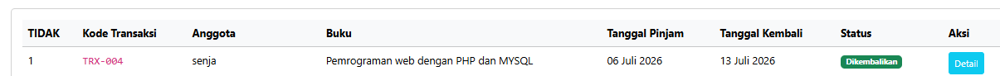

---

## 7. Perhitungan Denda

Denda dihitung secara otomatis sebesar **Rp5.000 per hari** apabila melewati batas tanggal pengembalian.

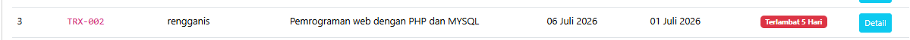

---

## 8. Laporan Transaksi

Halaman laporan seluruh transaksi perpustakaan.

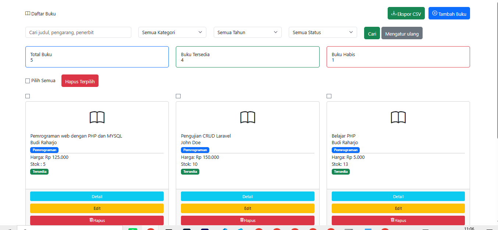

---

## 9. Filter Laporan

Laporan dapat difilter berdasarkan tanggal, status transaksi, dan anggota.

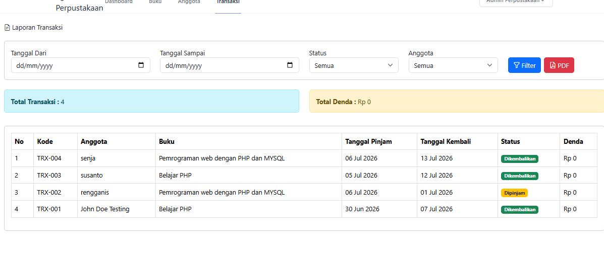

---

## 10. Export PDF

Laporan transaksi dapat diekspor menjadi file PDF.

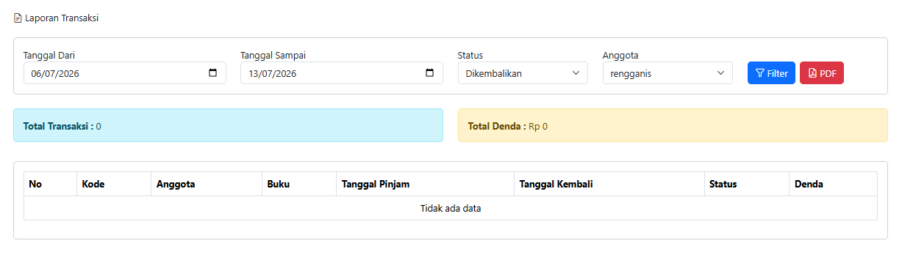
---

## 11. Dashboard Buku Terlambat

Widget yang menampilkan jumlah transaksi yang terlambat beserta daftar anggotanya.

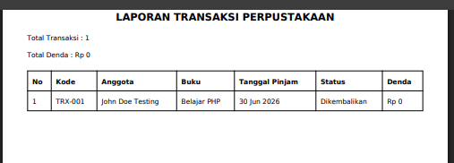

---

## 12. Badge Terlambat

Badge berwarna merah akan muncul pada transaksi yang melewati batas pengembalian.

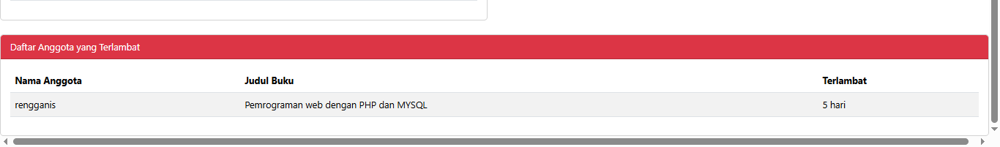

---

## 13. Reminder Keterlambatan

Peringatan akan muncul pada halaman detail transaksi jika buku belum dikembalikan setelah tanggal jatuh tempo.

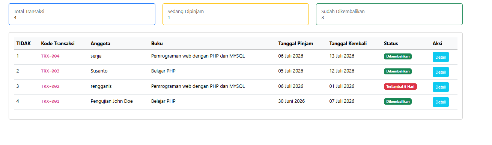
---

## 14. Database Transaksi

Struktur tabel transaksi pada database.


---

## 15. Database Buku

Struktur tabel buku yang menunjukkan perubahan stok setelah pengembalian.


---

# ⚙️ Cara Menjalankan Project

## 1. Clone Repository

```bash
git clone https://github.com/username/nama-repository.git
```

## 2. Masuk ke Folder Project

```bash
cd nama-repository
```

## 3. Install Dependency

```bash
composer install
```

## 4. Salin File Environment

```bash
cp .env.example .env
```

## 5. Generate Application Key

```bash
php artisan key:generate
```

## 6. Atur Konfigurasi Database

Sesuaikan file **.env** dengan database MySQL yang digunakan.

## 7. Jalankan Migration

```bash
php artisan migrate
```

## 8. Jalankan Seeder (jika ada)

```bash
php artisan db:seed
```

## 9. Jalankan Server Laravel

```bash
php artisan serve
```

---

# 🛠️ Teknologi yang Digunakan

* Laravel
* PHP
* MySQL
* Bootstrap
* HTML
* CSS
* JavaScript

---

# 📌 Fitur yang Dikerjakan

## ✅ Tugas 1

* Pengembalian buku
* Update stok otomatis
* Perhitungan denda Rp5.000/hari
* Menampilkan total denda pada detail transaksi

## ✅ Tugas 2

* Halaman laporan transaksi
* Filter tanggal
* Filter status
* Filter anggota
* Total transaksi
* Total denda
* Export PDF

## ✅ Tugas 3

* Widget buku terlambat
* Badge terlambat
* Reminder keterlambatan pada detail transaksi

---

# 📄 Lisensi

Project ini dibuat untuk memenuhi tugas mata kuliah **Pemrograman Web 2**.
