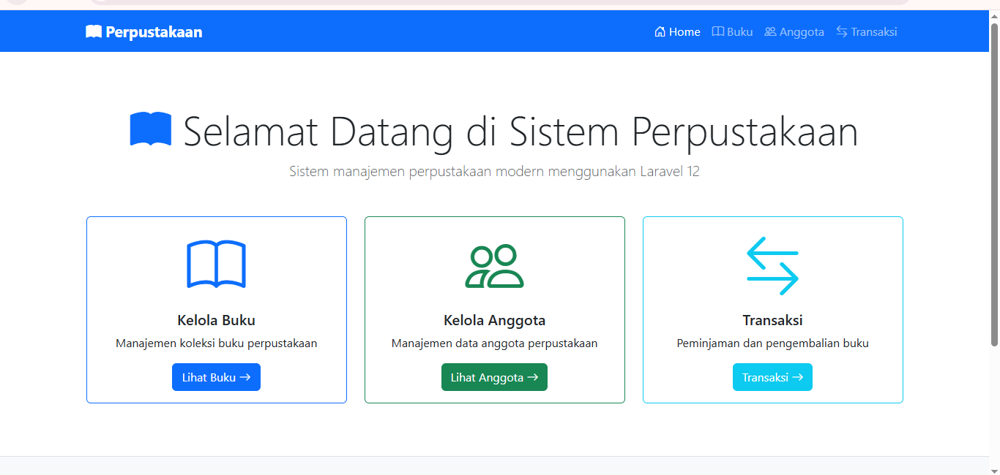
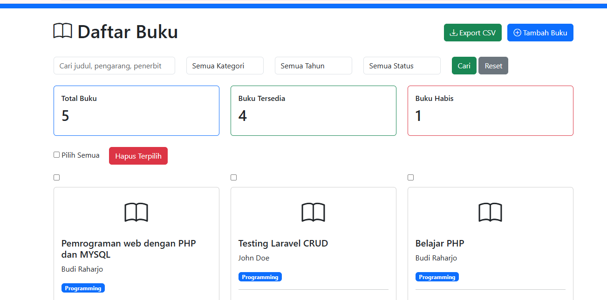
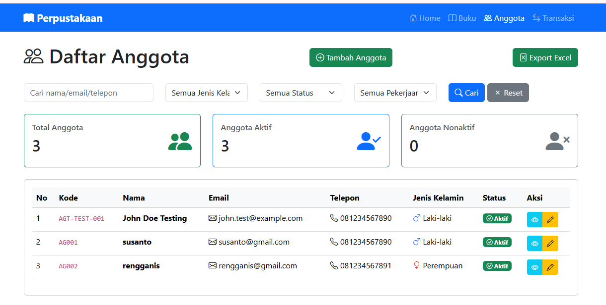
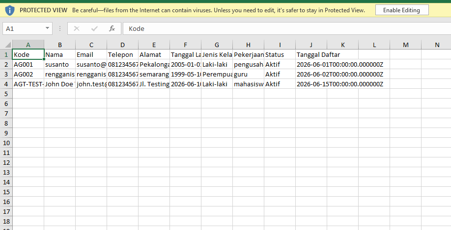
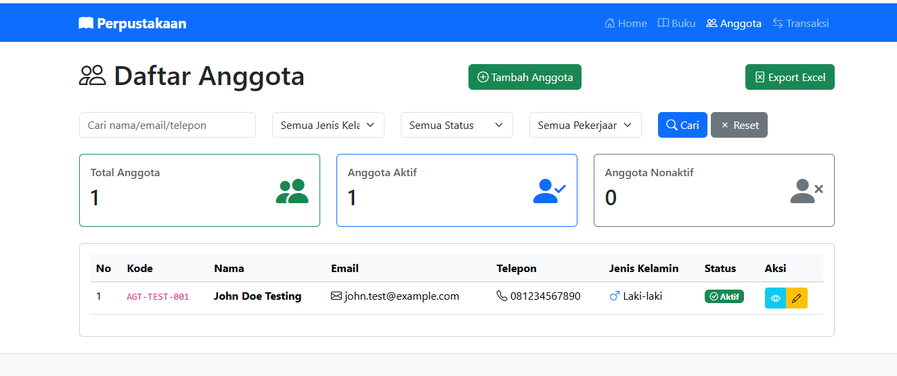

# Sistem Manajemen Perpustakaan Berbasis Web Menggunakan Laravel 12

## Deskripsi

Sistem Manajemen Perpustakaan merupakan aplikasi berbasis web yang dikembangkan menggunakan framework Laravel 12. Aplikasi ini digunakan untuk mengelola data buku dan data anggota perpustakaan secara mudah dan terstruktur.

Project ini dibuat sebagai tugas mata kuliah Pemrograman Web.

---

## Fitur Aplikasi

### Manajemen Buku

* Menampilkan daftar buku.
* Menambahkan data buku.
* Mengubah data buku.
* Menghapus data buku.
* Menampilkan detail buku.
* Pencarian dan filter buku.
* Export data buku ke file CSV.

### Manajemen Anggota

* Menampilkan daftar anggota.
* Menambahkan data anggota.
* Mengubah data anggota.
* Menghapus data anggota.
* Menampilkan detail anggota.
* Export data anggota ke file Excel (.xlsx) menggunakan Laravel Excel.
* Pencarian anggota berdasarkan nama, email, dan nomor telepon.
* Filter anggota berdasarkan:

  * Jenis Kelamin
  * Status Anggota
  * Pekerjaan

---

## Teknologi yang Digunakan

* PHP 8.3
* Laravel 12
* MySQL
* Bootstrap 5
* Laravel Excel (maatwebsite/excel)
* Composer

---

## Instalasi Project

### 1. Clone Repository

```bash
git clone https://github.com/username/perpustakaan.git
```

### 2. Masuk ke Folder Project

```bash
cd perpustakaan
```

### 3. Install Dependency

```bash
composer install
```

### 4. Salin File Environment

```bash
copy .env.example .env
```

### 5. Generate Application Key

```bash
php artisan key:generate
```

### 6. Konfigurasi Database

Buat database baru, kemudian sesuaikan konfigurasi database pada file `.env`.

```env
DB_DATABASE=perpustakaan
DB_USERNAME=root
DB_PASSWORD=
```

### 7. Jalankan Migrasi Database

```bash
php artisan migrate
```

### 8. Menjalankan Aplikasi

```bash
php artisan serve
```

Aplikasi dapat diakses melalui:

```text
http://127.0.0.1:8000
```

---

## Screenshot Aplikasi

### Dashboard



### Daftar Buku



### Daftar Anggota



### Export Data Anggota ke Excel



### Search dan Filter Anggota


## Struktur Database

### Tabel Buku

* id
* judul
* pengarang
* penerbit
* tahun_terbit
* kategori
* stok

### Tabel Anggota

* id
* kode_anggota
* nama
* email
* telepon
* alamat
* tanggal_lahir
* jenis_kelamin
* pekerjaan
* tanggal_daftar
* status

---

## Author

**Nama:** Zahra Zahrani
**NIM:** 6032401
**Program Studi:** Informatika


